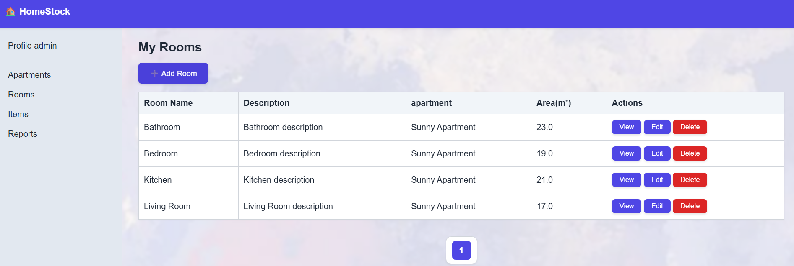
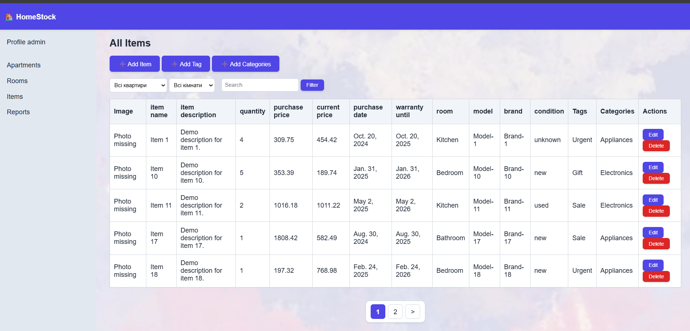
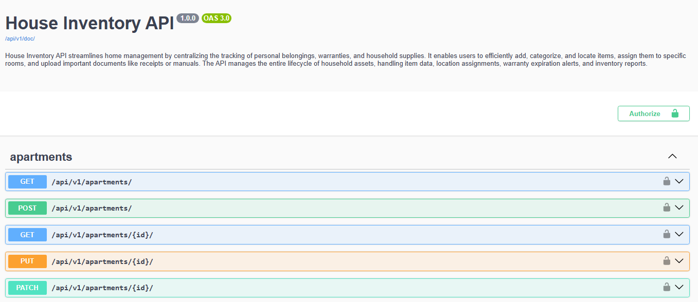
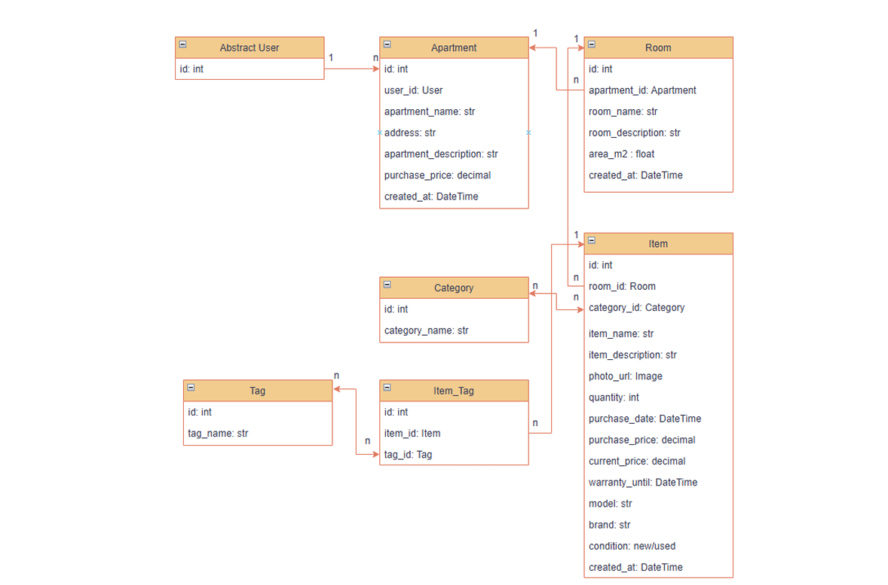

# 🏢 House Inventor Pro 🚀

**A full-featured system for managing real estate and inventory with a hierarchical structure, reports, and a powerful API.**

[](https://www.python.org/)
[](https://www.djangoproject.com/)
[](https://www.postgresql.org//)
[](https://www.docker.com/)
[](https://www.nginx.com/)

---

## 📝 Description

**Property Inventor Pro** is more than just a list of things. It is a comprehensive platform for managing all your property, organized by apartments and rooms. The system allows each user to create their own independent accounting spaces, adding an unlimited number of properties, rooms, and items within them.

Thanks to a flexible system of tags and categories, powerful search and filtering tools, as well as report generation, you get complete control over your inventory. The project is ideal for owners of multiple properties, for preparing for insurance, and for those who value order and detailed organization.

## ✨ Visual Demonstration

#### 📸 User's Apartment List


#### 📸 User's Room List


#### 📸 Room with a List of Items


#### 📸 Dashboard (Reports)


#### 📸 Interactive API Documentation (Swagger)


## 🌟 Key Logic and Features

### **👤 User Management and Security**
* 🔐 **Registration and Authentication:** A complete system for account creation and secure login.
* ✏️ **Profile Editing:** Ability for users to change their personal information.
* 🔑 **Password Change:** A secure procedure for updating the password.
* 🛡️ **Data Isolation:** Each user sees and manages **only their own** apartments, rooms, items, tags, and categories.

### **🏢 Hierarchical Inventory Management**
* 🏙️ **Apartments:**
    * Full CRUD (Create, Read, Update, Delete) for apartments.
    * Each apartment is securely linked to a specific user.
* 🚪 **Rooms:**
    * Full CRUD for rooms within a specified apartment.
    * Conveniently add a room with a dropdown list of the user's apartments.
    * Flexible option to move a room from one apartment to another.
* 📦 **Items:**
    * Full CRUD for items within a room.
    * 🔍 Powerful search and filtering across all of the user's items for instant access.

### **🏷️ Dynamic Tags and Categories**
* 🎨 **Personalized Tags and Categories:** Each user creates their own unique set of tags and categories for maximum flexibility.
* 📎 **Assignment:** Ability to assign one category and multiple tags to items.
* 📊 **Sorting and Filtering:** Easily sort and filter items by their assigned tags and categories.

### **📈 Reports and Analytics (Dashboard & Reports)**
* 💹 **Key Metrics:** Automatic calculation of the total number of items (`total_items`), their initial (`total_purchase_value`) and current (`total_current_value`) value.
* 🏠 **Apartment Analytics:** Display the value of property broken down by each individual apartment.
* 📄 **Export/Import to Excel:**
    * Ability to download a detailed report of all property in `.xlsx` format.
    * (In development) Ability to import data from an Excel file for quick population.
* ⚡ **Optimized Queries:** Efficient database queries for fast calculation of statistics on the dashboard.

## 🛠️ Tech Stack

| Category                   | Technology / Tool                                                              |
| -------------------------- | ------------------------------------------------------------------------------------- |
| **🖥️ Backend** | `Python`, `Django`, `Django Rest Framework`                                           |
| **🎨 Frontend** | `Django Templates`, `HTML5`, `CSS3`                                                   |
| **🗄️ Database** | `PostgreSQL` (in Docker) / `SQLite3` (locally)                                      |
| **🐳 Containerization** | `Docker`, `Docker Compose`                                                            |
| **🌐 Web Server / Proxy** | `Nginx` (used as a reverse proxy for Django)                                |
| **📜 API Documentation** | `drf-yasg` (for generating `Swagger` and `ReDoc`)                                       |

## ⚙️ Installation and Launch

### **Step 1: Clone the repository** 📂
```bash
git clone [https://github.com/b4oody/house_inventory.git](https://github.com/b4oody/house_inventory.git)
cd house_inventory
```

### **Step 2: Configure the `.env` file** 🔑
```bash
cp env.sample .env
```
**❗️ Important:** Open `.env` and replace `SECRET_KEY` with a unique, complex value.

### **Step 3: Run with Docker (Recommended) 🐳**
```bash
docker-compose up --build -d
```
The project will be available at 👉 **`http://localhost/`**.

### **Step 4: Local Launch (Alternative) 💻**
1.  **Create a virtual environment:** `python -m venv venv && source venv/bin/activate`
2.  **Install dependencies:** `pip install -r requirements.txt`
3.  **Apply migrations:** `python manage.py migrate`
4.  **Create a superuser:** `python manage.py createsuperuser`
5.  **Run the server:** `python manage.py runserver`
The project will be available at 👉 **`http://localhost:8000/`**.

## 🌍 API Documentation and Key Routes

Interactive API documentation is available after launch:
* **Swagger UI:** [http://localhost/api/v1/swagger/](http://localhost/api/v1/swagger/)
* **ReDoc:** [http://localhost/api/v1/redoc/](http://localhost/api/v1/redoc/)

## 🗄️ Database Structure

Data is organized in a relational structure that reflects the "owner -> apartment -> room -> item" logic.

* **User**: The main user model (built into Django).
* **Apartment**: Belongs to `User` (One-to-Many).
* **Room**: Belongs to `Apartment` (One-to-Many).
* **Category**: Belongs to `User` (One-to-Many).
* **Tag**: Belongs to `User` (One-to-Many).
* **Item**: Belongs to `Room` and `Category` (One-to-Many), and has a relationship with `Tag` (Many-to-Many).

#### ER Diagram


## 📁 Expanded Project Structure

```
house_inventory/
├── .venv/                  # 🐍 Python virtual environment (local)
├── api/                    # 🚀 Main Django app where all logic resides
│   ├── migrations/         # Database migration files
│   ├── models.py           # ✅ Model definitions (Apartment, Room, Item, etc.)
│   ├── serializers.py      # 🔄 Serializers for converting models to JSON
│   ├── views.py            # 🧠 Request handling logic (API Endpoints)
│   ├── urls.py             # 🛣️ Routing for the API
│   └── ...
├── house_core/             # ⚙️ Main Django configuration app
│   ├── settings.py         # Global project settings
│   ├── urls.py             # Main routing file
│   └── ...
├── media/                  # 🖼️ Directory for user-uploaded files (item photos)
├── nginx/                  # 🌐 Configuration for Nginx web server
│   └── default.conf        # Rules for proxying requests to Django
├── static/                 # 🎨 Project static files (CSS, JS, images for templates)
├── staticfiles/            # 📦 Directory where Django collects all static files for deployment
├── templates/              # 📄 HTML templates for rendering pages
├── .env                    # 🔑 Environment variables (local secrets, settings)
├── .env.sample             # 📄 Example configuration file
├── .gitignore              # 🚫 Files and folders ignored by Git
├── db.sqlite3              # 🗄️ SQLite database file for local development
├── docker-compose.yml      # 🐳 Container orchestration (db, app, nginx)
├── Dockerfile              # 📜 Instructions for building the application's Docker image
├── entrypoint.sh           # 🎬 Script that runs when the Docker container starts
├── fixture_test.py         # 🧪 Script for generating test data
├── items_fixture.json      # 📦 JSON file with test data (fixture)
├── manage.py               # 🛠️ Command-line utility for managing Django
├── README.md               # 📖 This file
└── requirements.txt        # 📦 List of Python dependencies
```

## 🤝 Contributing

Any contributions are welcome!
1.  **Fork** the repository.
2.  Create a new **branch** (`git checkout -b feature/MyAwesomeFeature`).
3.  Make your **commit** (`git commit -m 'Add MyAwesomeFeature'`).
4.  **Push** to the branch (`git push origin feature/MyAwesomeFeature`).
5.  Create a **Pull Request**.

## 👤 Author
**b4oody** - [GitHub Profile](https://github.com/b4oody)
